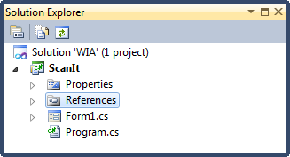
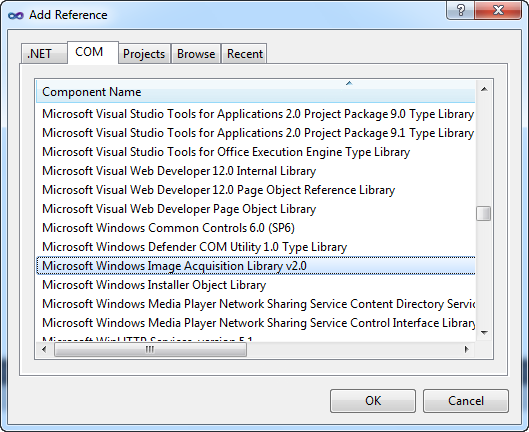
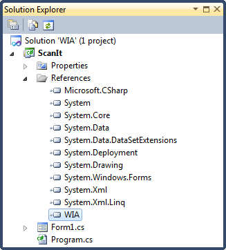
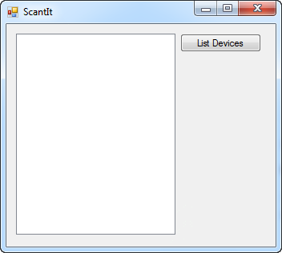
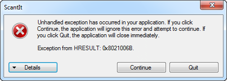
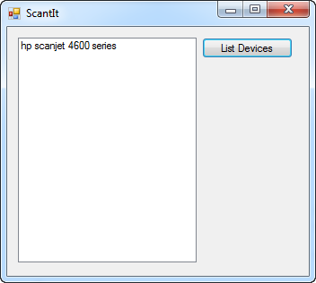
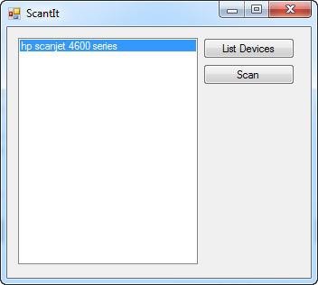

# Windows Image Acquisition (WIA)

## Introduction

A couple of years ago, in December 2006, I had to write a program that was able to instruct a scanner to scan a document and save the result to an image file. Back then, I had to write it using [Delphi 6](http://en.wikipedia.org/wiki/Embarcadero_Delphi). After some research (or Googling) I came accross the [Windows Image Acquisition](http://msdn.microsoft.com/en-us/library/ms630368.aspx) platform.

The WIA platform enables you to interact with imaging hardware such as scanners, webcams, printers...etc. allowing you to talk to hardware from different manufacturers. Wondering if this platform is still supported on Windows 7 I decided to find out. Let's see if we can scan some documents.

## WIA 2.0 & Windows 7

WIA 1.0 was introduced in Windows Me (Mistake Edition) and XP. WIA 2.0 was released with Windows Vista and is mainly targeted towards scanners. Check out the [Windows Portable Devices (WPD)](<http://msdn.microsoft.com/en-us/library/ms740786(VS.85).aspx>) API for dealing with digital camers and digital video devices.

So WIA 2.0 was introduced with Vista, but is it still supported in Windows 7? For this post I hooked up a HP Scanjet 4670 scanner, but any WIA-compatible scanner will do.

## System Devices

Let's start by listing all the WIA-compatible devices connected to our PC. Start up Visual Studio 2010 and create a new blank solution named WIA. Add a new Windows Forms application called ScanIt to it.



To access WIA 2.0, you'll need to add a reference to the COM library "Microsoft Windows Image Acquisition Library v2.0".



Go ahead and add the reference. Afterwards select the reference and set the property Embed Interop Types to false.



Next I added a listbox ("Devices") and a button ("ListDevices") to the main form.



In the button's Click event handler I added the following code:

```csharp
private void ListDevices_Click(object sender, EventArgs e)
{
    // Clear the ListBox.
    Devices.Items.Clear();

    // Create a DeviceManager instance
    var deviceManager = new DeviceManager();

    // Loop through the list of devices and add the name to the listbox
    for (int i = 1; i <= deviceManager.DeviceInfos.Count; i++)
    {
        var deviceName = deviceManager.DeviceInfos[i].Properties["Name"].get_Value().ToString();
        Devices.Items.Add(deviceName);
    }
}
```

**Remark**: Note that in the code I treat the DeviceInfos array as a 1-based array instead of a zero-based array! If you treat it as a zero-based array you'll get a COM exception ("Exception from HRESULT: 0x8021006B").



Hit F5 to run the application and click the button to list all the WIA-compatible devices.



## Scanners

For this post we're only interested in scanners, not all the devices. We need to figure out which device is a scanner and which is not. Luckily this information is provided by the WIA platform. The DeviceInfo instance contains a [Type property](<http://msdn.microsoft.com/en-us/library/ms630321(v=vs.85).aspx>) which retrieves the type of the Windows Image Acquisition (WIA) hardware device.

The possible values for the Type property are:

- Digital Camera
- Scanner
- Streaming Video
- Default

Add a new class type called Scanner to the application and add the following code it:

```csharp
public class Scanner
{
    private readonly DeviceInfo _deviceInfo;

    public Scanner(DeviceInfo deviceInfo)
    {
        this._deviceInfo = deviceInfo;
    }

    public void Scan()
    {
        // Connect to the device and instruct it to scan
    }

    public override string ToString()
    {
        return this._deviceInfo.Properties["Name"].get_Value();
    }
}
```

Now adjust the code of the ListDevices button's Click event handler as follows:

```csharp
private void ListDevices_Click(object sender, EventArgs e)
{
    // Clear the ListBox.
    Devices.Items.Clear();

    // Create a DeviceManager instance
    var deviceManager = new DeviceManager();

    // Loop through the list of devices and add the name to the listbox
    for (int i = 1; i <= deviceManager.DeviceInfos.Count; i++)
    {
        //Add the device to the list if it is a scanner
        if (deviceManager.DeviceInfos[i].Type != WiaDeviceType.ScannerDeviceType)
        {
            continue;
        }

        Devices.Items.Add(new Scanner(deviceManager.DeviceInfos[i]));
    }
}
```

Before adding a device to the list we check if it is in fact a scanner. If not, we skip it. Next we wrap the DeviceInfo instance in an instance of the Scanner class and add it to the list.

## Scanning

Once we've determined which scanners are linked to the computer we can instruct them to scan an image. Add a scan button to the main form and add the following code to it's Click event handler.

```csharp
private void Scan_Click(object sender, EventArgs e)
{
    // Scanner selected?
    var device = Devices.SelectedItem as Scanner;
    if (device == null)
    {
        MessageBox.Show("Please select a device.", "Warning",
                        MessageBoxButtons.OK, MessageBoxIcon.Warning);
        return;
    }

    // Scan
    var image = device.Scan();

    // Save the image
    var path = @"c:\scan.jpeg";
    if (File.Exists(path))
    {
        File.Delete(path);
    }
    image.SaveFile(path);
}
```

This code checks if you selected a scanner in the ListBox, then instructs the selected scanner to scan an image and saves it to the root of the C-drive.



The implementation for the Scan method of the Scanner class is quite simple:

```csharp
public ImageFile Scan()
{
    // Connect to the device
    var device = this._deviceInfo.Connect();

    // Start the scan
    var item = device.Items[1];
    var imageFile = (ImageFile) item.Transfer(FormatID.wiaFormatJPEG);

    // Return the imageFile
    return imageFile;
}
```

A connection to the device is established by calling the Connect method of the DeviceInfo instance. This method returns an instance of the Device class. Next the image is scanned by calling the Transfer method on the first item found in the Device's Items array property. You can specify the desired format (JPEG, GIF, PNG...) when calling the Transfer method. Just make sure your scanner supports the selected format.

Using the WIA platform you can also control the settings of your scanner (DPI, grayscale...etc.), but I'll leave that to the reader as an exercise.
